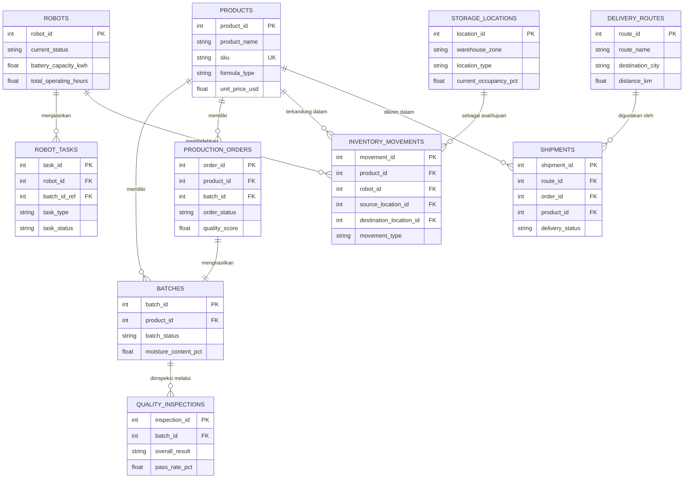

# Laporan Peninjauan Komprehensif Dataset: Pabrik Susu Bayi dengan Robot Gudang (Baby Milk Factory with Warehouse Robots)

Laporan ini menyajikan tinjauan mendalam terhadap **10 dataset CSV** yang terdapat di dalam ruang kerja Anda. Dataset ini membentuk arsitektur data yang sangat kaya, terintegrasi, dan mencakup seluruh siklus operasional pabrik susu formula bayi modern—mulai dari produksi susu formula, kontrol kualitas batch, manajemen inventaris gudang yang diotomatisasi oleh robot, hingga pengiriman logistik regional.

---

## 📊 Ringkasan Dataset & Struktur Hubungan

Dataset ini terbagi menjadi 5 domain utama yang saling terhubung erat. Berikut adalah diagram relasi entitas (ERD) yang memvisualisasikan bagaimana kesepuluh dataset ini saling terikat satu sama lain:

---

## 🔍 Peninjauan Detail Domain & Dataset

### Domain 1: Robot Gudang & Otomatisasi (Robots & Tasks)

Domain ini mencatat profil robot otonom di gudang (seperti AMR, AGV, Palletizer, Sorter, dll.) serta riwayat seluruh tugas yang mereka kerjakan.

#### 1. [`ds1_robots.csv`](file:///c:/Users/hpvic/OneDrive/Documents/Baby%20Milk%20Factory%20with%20Warehouse%20Robots/ds1_robots.csv) (10,000+ Baris)
*   **Deskripsi**: Profil lengkap setiap robot di gudang pabrik.
*   **Kolom Utama**:
    *   `robot_id` (Primary Key): ID unik robot.
    *   `robot_type` (Categorical): Jenis robot (`AMR`, `AGV`, `Palletizer`, `Sorter`, `Depalletizer`, `Arm`, `Cobot`).
    *   `manufacturer` & `model_name`: Pabrikan (Fanuc, OMRON, Kuka, ABB, Geek+, Locus, 6 River).
    *   `battery_capacity_kwh`: Kapasitas baterai (kwh).
    *   `max_payload_kg`: Kapasitas beban maksimal (50 kg s.d. 1500 kg).
    *   `max_speed_ms`: Kecepatan puncak (m/s).
    *   `warehouse_zone`: Zona penugasan gudang (`A` s.d. `F`).
    *   `current_status` (Categorical): Status saat ini (`Active`, `Idle`, `Charging`, `Maintenance`, `Error`, `Decommissioned`).
    *   `total_operating_hours` & `total_tasks_completed`: Jam kerja kumulatif dan jumlah tugas yang diselesaikan.
    *   `error_count_lifetime`: Frekuensi kegagalan robot sepanjang masa operasionalnya.

#### 2. [`ds1_robot_tasks.csv`](file:///c:/Users/hpvic/OneDrive/Documents/Baby%20Milk%20Factory%20with%20Warehouse%20Robots/ds1_robot_tasks.csv) (10,000+ Baris)
*   **Deskripsi**: Riwayat penugasan robot yang bersifat transaksional.
*   **Kolom Utama**:
    *   `task_id` (Primary Key): ID unik tugas.
    *   `robot_id` (Foreign Key): Menghubungkan tugas ke robot spesifik.
    *   `task_type` (Categorical): Jenis penugasan (`Pick`, `Place`, `Transport`, `Replenishment`, `Maintenance`, `Inspection`, `Charging`).
    *   `duration_minutes`: Durasi eksekusi tugas.
    *   `source_zone` & `destination_zone`: Alur perpindahan fisik barang.
    *   `weight_kg` & `quantity_units`: Berat barang dan kuantitas unit formula bayi yang dipindahkan.
    *   `task_status` (Categorical): Status tugas (`Completed`, `Failed`, `Cancelled`, `Partial`, `In-Progress`).
    *   `error_occurred` & `error_code`: Penanda jika terjadi malfungsi robot saat bertugas.
    *   `energy_consumed_kwh`: Jumlah daya baterai yang terkonsumsi untuk tugas tersebut.
    *   `batch_id_ref` (Foreign Key): Referensi ke batch produksi yang sedang ditangani.

> [!TIP]
> **Potensi Analisis**: Kita bisa menghitung korelasi antara `battery_capacity_kwh` dengan `energy_consumed_kwh` per jenis tugas, mengidentifikasi robot dengan rasio error tertinggi (`error_count_lifetime` vs `total_tasks_completed`), serta menganalisis efisiensi robot berdasarkan total beban (`weight_kg`) yang diangkut.

---

### Domain 2: Katalog Produk & Rencana Produksi (Products & Production)

Domain ini melacak informasi formulasi produk susu formula bayi serta status realisasi perintah kerja (perintah produksi) di lini perakitan pabrik.

#### 3. [`ds2_products.csv`](file:///c:/Users/hpvic/OneDrive/Documents/Baby%20Milk%20Factory%20with%20Warehouse%20Robots/ds2_products.csv) (10,000+ Baris)
*   **Deskripsi**: Informasi master produk susu formula bayi.
*   **Kolom Utama**:
    *   `product_id` (Primary Key): ID unik produk.
    *   `product_name`: Merk dagang produk (seperti *BabyGold Organic*, *MilkPure Toddler*, *NutriStart*, *BetaBoost*, *LactoFree*, *SoyaBliss*).
    *   `sku` (Unique Key): Kode inventaris barang (`SKUXXXXX`).
    *   `category`: Kategori usia/nutrisi (`Infant Formula`, `Follow-On Formula`, `Toddler Milk`, `Specialty Formula`).
    *   `formula_type`: Jenis formula dasar (`Soy-Based`, `Hydrolyzed`, `Whey-Based`, `Casein-Based`, `Amino Acid-Based`).
    *   `age_group_months`: Rekomendasi umur konsumsi (0-6, 6-12, 12-24, 24-36, 36+ bulan).
    *   `unit_price_usd` & `cost_price_usd`: Harga jual retail vs biaya produksi per unit (margin profitabilitas).
    *   `certification`: Standar sertifikasi produk (`HACCP`, `Organic`, `Halal`, `Kosher`, `ISO22000`).
    *   `shelf_life_days` & `storage_temp_min_c`/`max_c`: Masa kedaluwarsa dan ambang batas suhu penyimpanan yang aman.
    *   `protein_content_pct` & `fat_content_pct`: Kandungan zat gizi makro formula susu.

#### 4. [`ds2_production_orders.csv`](file:///c:/Users/hpvic/OneDrive/Documents/Baby%20Milk%20Factory%20with%20Warehouse%20Robots/ds2_production_orders.csv) (10,000+ Baris)
*   **Deskripsi**: Detail transaksi atas perintah produksi di pabrik.
*   **Kolom Utama**:
    *   `order_id` (Primary Key): ID perintah produksi.
    *   `product_id` (Foreign Key): Menunjuk ke master produk susu formula.
    *   `batch_id` (Foreign Key): ID unik dari kelompok produksi (Batch).
    *   `planned_quantity_units` & `actual_quantity_units`: Target rencana produksi vs kuantitas aktual yang berhasil dikemas.
    *   `production_line`: Lini mesin pengisi formula susu (`Line-1` s.d. `Line-5`).
    *   `quality_score`: Skor jaminan kualitas batch yang diproduksi (skala 0-100).
    *   `rejection_rate_pct`: Persentase susu formula yang tidak lolos standar pengemasan di lini produksi.
    *   `order_status`: Status perintah kerja (`Completed`, `In-Progress`, `Scheduled`, `On-Hold`, `Cancelled`).
    *   `robot_assisted` (Boolean): Indikator apakah proses packaging/palletizing dibantu oleh lengan robot gudang.

---

### Domain 3: Inventaris & Lokasi Penyimpanan (Inventory & Storage)

Domain ini memantau tata letak spasial gudang pabrik dan melacak semua bentuk pergerakan logistik internal (Inbound/Outbound/Transfer stok).

#### 5. [`ds3_storage_locations.csv`](file:///c:/Users/hpvic/OneDrive/Documents/Baby%20Milk%20Factory%20with%20Warehouse%20Robots/ds3_storage_locations.csv) (10,000+ Baris)
*   **Deskripsi**: Tata letak rak penyimpanan spasial di dalam gudang.
*   **Kolom Utama**:
    *   `location_id` (Primary Key): ID unik untuk setiap bin/kotak penyimpanan.
    *   `warehouse_zone`: Zona penyimpanan (`A` s.d. `F`).
    *   `aisle`, `rack`, `shelf`, `bin`: Koodinat fisik spesifik lokasi barang.
    *   `location_type` (Categorical): Fungsi penyimpanan (`Bulk`, `Overflow`, `Pick`, `Quarantine`, `Returns`, `Staging`).
    *   `capacity_kg` & `capacity_units`: Batas maksimal tampung berat dan kuantitas unit.
    *   `current_occupancy_pct`: Tingkat keterisian ruang (0% s.d. 100%).
    *   `temperature_controlled` & `humidity_controlled`: Indikator sensor suhu dan kelembapan ruangan.
    *   `location_status`: Kondisi bin (`Occupied`, `Available`, `Blocked`, `Reserved`, `Maintenance`).
    *   `barcode`: Barcode unik untuk pelacakan RFID/Scan Robot.

#### 6. [`ds3_inventory_movements.csv`](file:///c:/Users/hpvic/OneDrive/Documents/Baby%20Milk%20Factory%20with%20Warehouse%20Robots/ds3_inventory_movements.csv) (10,000+ Baris)
*   **Deskripsi**: Log transaksi mutasi perpindahan stok barang di dalam gudang.
*   **Kolom Utama**:
    *   `movement_id` (Primary Key): ID transaksi pergerakan stok.
    *   `product_id` (Foreign Key): Produk susu formula yang dimutasikan.
    *   `movement_type`: Arah pergerakan stok (`Inbound`, `Outbound`, `Transfer`, `Return`, `Adjustment`, `Disposal`).
    *   `quantity_units` & `weight_kg`: Kuantitas susu yang dipindahkan.
    *   `robot_id` (Foreign Key): Robot gudang yang ditugaskan memindahkan barang tersebut secara otomatis.
    *   `source_location_id` & `destination_location_id` (Foreign Keys): Koordinat asal dan tujuan bin penyimpanan.
    *   `unit_cost_usd` & `total_cost_usd`: Biaya modal per unit dan total valuasi pergerakan barang.
    *   `movement_status`: Status perpindahan (`Confirmed`, `Pending`, `Error`, `Cancelled`).
    *   `temperature_at_movement_c`: Suhu sensor pembaca saat barang sedang dalam proses pemindahan oleh robot gudang.

> [!NOTE]
> **Korelat Gudang**: `INVENTORY_MOVEMENTS` adalah jembatan emas yang menghubungkan `PRODUCTS` (apa yang dipindahkan), `ROBOTS` (siapa yang memindahkan), dan `STORAGE_LOCATIONS` (dari bin mana ke bin mana barang tersebut dipindahkan).

---

### Domain 4: Manajemen Batch & Pengendalian Mutu (Batches & Quality)

Domain ini bertugas menjaga keandalan formula bayi, menguji keamanan nutrisi, mendeteksi kontaminasi bakteri/kimia sebelum susu dirilis ke pasar.

#### 7. [`ds4_batches.csv`](file:///c:/Users/hpvic/OneDrive/Documents/Baby%20Milk%20Factory%20with%20Warehouse%20Robots/ds4_batches.csv) (10,000+ Baris)
*   **Deskripsi**: Catatan manufaktur untuk setiap kumpulan (Batch) formula susu.
*   **Kolom Utama**:
    *   `batch_id` (Primary Key): ID unik batch.
    *   `product_id` (Foreign Key): Varian produk susu yang diproduksi.
    *   `production_date` & `expiry_date`: Tanggal manufaktur dan kedaluwarsa batch.
    *   `batch_size_units` & `batch_size_kg`: Volume batch yang dihasilkan.
    *   `mixing_time_min`: Lama waktu pencampuran bahan baku (menit).
    *   `pasteurization_temp_c` & `drying_temp_c`: Suhu pasteurisasi (menghilangkan patogen) dan suhu pengeringan (menjadi bubuk formula).
    *   `moisture_content_pct`: Kadar air hasil akhir (sangat krusial untuk mencegah pertumbuhan bakteri).
    *   `batch_status` (Categorical): Status kelayakan rilis (`Released`, `Quarantine`, `Rejected`, `Recalled`).
    *   `yield_efficiency_pct`: Efisiensi hasil produksi bahan baku menjadi produk jadi (%).

#### 8. [`ds4_quality_inspections.csv`](file:///c:/Users/hpvic/OneDrive/Documents/Baby%20Milk%20Factory%20with%20Warehouse%20Robots/ds4_quality_inspections.csv) (10,000+ Baris)
*   **Deskripsi**: Laporan hasil laboratorium jaminan mutu (QA/QC) untuk setiap batch.
*   **Kolom Utama**:
    *   `inspection_id` (Primary Key): ID inspeksi lab.
    *   `batch_id` (Foreign Key): Batch yang diuji.
    *   `inspection_type`: Jenis pengujian (`Incoming`, `In-Process`, `Chemical`, `Microbiological`, `Sensory`, `Final`).
    *   `pass_rate_pct`: Persentase sampel yang lolos uji dalam satu batch.
    *   `moisture_result_pct`, `protein_result_pct`, `fat_result_pct`: Hasil lab riil untuk nutrisi formula.
    *   `contamination_detected` (Boolean): Adanya indikator zat asing atau cemaran berbahaya.
    *   `contamination_type`: Jenis cemaran (`None`, `Bacterial`, `Heavy Metal`, `Pesticide`, `Foreign Object`).
    *   `packaging_integrity_score`: Skor kekuatan segel kemasan kaleng/tin (skala 1-10).
    *   `overall_result`: Hasil final pengujian (`Pass`, `Fail`, `Conditional Pass`, `Pending`).
    *   `action_taken`: Keputusan QA (`Released`, `Hold`, `Rework`, `Destroy`, `Re-test`).

> [!WARNING]
> **Kritis untuk Keamanan Pangan**: Hubungan antara `moisture_content_pct` di dataset Batches, `moisture_result_pct` di Quality Inspections, serta munculnya `Bacterial` di `contamination_type` adalah area analisis krusial untuk memastikan tidak ada formula bayi terkontaminasi bakteri berbahaya (seperti *Cronobacter*) yang lolos ke pasaran.

---

### Domain 5: Distribusi & Logistik Pengiriman (Routes & Shipments)

Domain ini mencakup data rantai pasok eksternal dari gudang pabrik menuju kota-kota distributor di Asia Tenggara (Indonesia, Malaysia, Singapura, Filipina, Vietnam).

#### 9. [`ds5_delivery_routes.csv`](file:///c:/Users/hpvic/OneDrive/Documents/Baby%20Milk%20Factory%20with%20Warehouse%20Robots/ds5_delivery_routes.csv) (10,000+ Baris)
*   **Deskripsi**: Master data rute ekspedisi logistik.
*   **Kolom Utama**:
    *   `route_id` (Primary Key): ID rute logistik.
    *   `route_name`: Kode rute (`RT-XXXX`).
    *   `origin_warehouse`: Gudang asal barang (`Jakarta-WH1`, `Jakarta-WH2`, `Surabaya-WH`, `Bandung-WH`, `Medan-WH`).
    *   `destination_city` & `destination_country`: Kota dan negara tujuan pengiriman produk.
    *   `distance_km` & `estimated_duration_hours`: Jarak rute fisik dan estimasi waktu tempuh perjalanan.
    *   `transport_mode` (Categorical): Moda angkutan (`Truck`, `Sea`, `Air`, `Rail`, `Courier`).
    *   `carrier_name`: Nama jasa ekspedisi cargo (FedEx, JNE, SiCepat, DHL, J&T, Tiki, Pos Indonesia).
    *   `base_cost_usd` & `cost_per_kg_usd`: Tarif dasar dan tarif per kg pengiriman (variabel penentu biaya logistik).
    *   `cold_chain_required` (Boolean): Persyaratan kontainer pendingin aktif (sangat penting untuk menjaga kualitas protein susu formula selama di laut/darat).
    *   `avg_delay_hours`: Rata-rata keterlambatan historis pada rute tersebut.

#### 10. [`ds5_shipments.csv`](file:///c:/Users/hpvic/OneDrive/Documents/Baby%20Milk%20Factory%20with%20Warehouse%20Robots/ds5_shipments.csv) (10,000+ Baris)
*   **Deskripsi**: Transaksi pengiriman kontainer susu formula riil secara harian.
*   **Kolom Utama**:
    *   `shipment_id` (Primary Key): ID pengiriman unik.
    *   `route_id` (Foreign Key): Rute ekspedisi yang ditempuh.
    *   `order_id` (Foreign Key): Pesanan/Perintah produksi yang dikirimkan.
    *   `shipment_date` & `actual_delivery_date`: Tanggal keberangkatan dan tanggal penerimaan barang di kota tujuan.
    *   `temperature_min_c` & `temperature_max_c`: Suhu termometer kontainer selama perjalanan (Audit rantai pendingin/Cold Chain).
    *   `customs_cleared` (Boolean): Status lolos bea cukai pelabuhan internasional.
    *   `total_cost_usd`: Akumulasi biaya riil pengiriman (tarif rute + beban berat barang).
    *   `delivery_status` (Categorical): Status pengiriman (`Delivered`, `Delayed`, `Failed`, `Returned`, `In-Transit`).
    *   `delay_reason`: Alasan keterlambatan (`None`, `Customs`, `Weather`, `Traffic`, `Capacity`, `Address Error`).
    *   `customer_satisfaction_score`: Skor survei kepuasan pembeli/distributor (skala 1.0 - 5.0).

---
